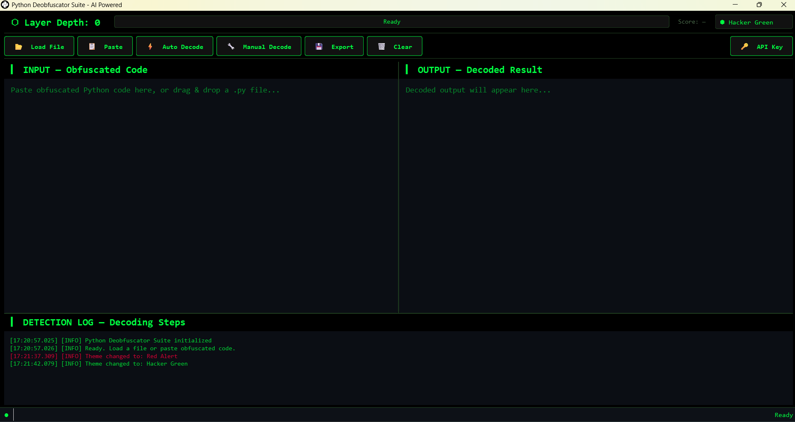
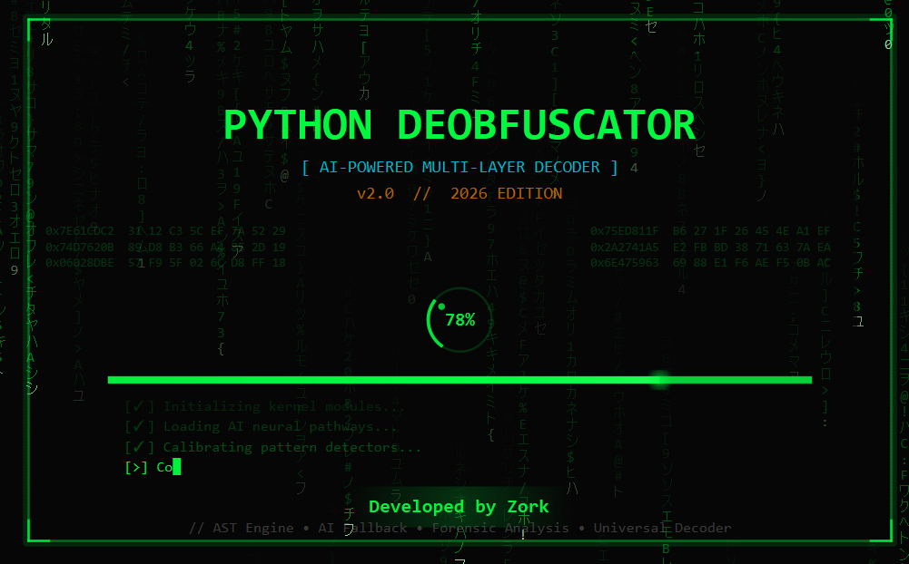

<div align="center">

<!-- Animated Header Banner -->


<!-- Animated Typing SVG -->
<a href="#">
  
</a>

<br/>

<!-- Badges Row 1 - Status & Version -->
<p>
  
  
  
  
</p>

<!-- Badges Row 2 - Tech Stack -->
<p>
  
  
  
  
  
  
</p>

<!-- Animated Divider -->


</div>

<!-- ═══════════════════════════════════════════════════════════════════════════════ -->

##  What Is This?

> **Python Deobfuscator Suite** is an enterprise-grade, AI-powered tool that automatically detects and decodes **multi-layered obfuscated Python code** — with support for **500+ recursive layers**, **30+ obfuscation types**, **AI fallback** via OpenRouter, **sandboxed execution**, and **deep forensic analysis** — all wrapped in a stunning **Matrix-themed PyQt6 GUI**.

<!-- ═══════════════════════════════════════════════════════════════════════════════ -->


##  Feature Arsenal

<div align="center">

### 🧠 AI-Powered Decoding Engine

| Feature | Detail |
|:---|:---|
| 🤖 AI Model | `arcee-ai/trinity-large-preview` via OpenRouter |
| 🔄 Auto Retry | Up to 3 consecutive AI fallbacks per layer |
| 🎯 Pattern-Aware | Sends extracted lambda/exec patterns to AI |
| 📝 Error Context | AI receives previous failure info for smarter prompts |
| 📦 8K Context | Handles large obfuscated payloads |

---

### 🔐 Sandbox Execution Engine

| Feature | Detail |
|:---|:---|
| 🛡️ Namespace | No `os`, `sys`, `subprocess` access |
| ⏱️ Timeout | 10-second execution limit per call |
| 🚫 Whitelist | Only safe modules (`base64`, `zlib`, `marshal`...) |
| 🧪 Isolation | Each execution in daemon thread |
| 🔍 Validation | AST-based security scanning before exec |

---

### 🔍 30+ Obfuscation Type Detection

| Category | Types Detected |
|:---|:---|
| **Standard** | Base64, Hex, Zlib, Marshal, LZMA, Gzip, ROT13 |
| **Exec Wrappers** | `exec()`, `eval()`, `compile()`, Lambda |
| **Chained** | Marshal+Zlib+B64, LZMA+B64, B85 |
| **Tool-Specific** | PyArmor, Cython, Nuitka, PyInstaller |
| **Advanced** | XOR, chr-join, Fernet, AES |
| **Behavioral** | Variable rename, Dead code, Control flow |
| **Custom** | Hyperion, Intensio, BlastObfuscator, Ninja |

---

### 🕵️ Forensic Intelligence Extractor

| Intelligence | Extraction |
|:---|:---|
| 🌐 Network IOCs | URLs, IPs, Domains, Emails |
| 🔑 Credentials | API Keys, Tokens, AWS/GitHub PATs |
| 📂 File System | File paths, Imports, Payloads |
| ⚠️ Behaviors | Shell exec, Keylogger, Webhook |
| 🔮 XOR Strings | Lambda-encoded auto-resolution |
| 🏗️ Structure | Functions, Classes, Variables |
| 💻 Platform | Architecture & OS markers |
| 📦 Binary | ZIP, ELF, PE embedded data |

</div>

<!-- ═══════════════════════════════════════════════════════════════════════════════ -->


##  UI Showcase

<div align="center">

### 🖥️ Hacker-Themed Matrix GUI

> **Split-pane layout** with INPUT / OUTPUT editors, real-time detection log, obfuscation scoring, theme selector, and drag-and-drop file support.

<br>



<br>

**Toolbar:**  `📂 Load` · `📋 Paste` · `⚡ Auto Decode` · `🔧 Manual` · `💾 Export` · `🗑 Clear` · `🔑 API Key`

**Panels:**
| Panel | Description |
|:---|:---|
| ▎ **INPUT** | Paste or drag-drop obfuscated `.py` files |
| ▎ **OUTPUT** | Decoded clean source + forensic report |
| ▎ **LOG** | Real-time layer-by-layer decode progress |
| **Score** | Live obfuscation score `0-100` with color indicator |
| **Depth** | Layer depth counter updated per decode step |

</div>

<details>
<summary><b>🎬 Animated Splash Screen Features</b></summary>
<br>

<div align="center">

</div>
<br>

| Effect | Description |
|:---|:---|
| 🟢 **Matrix Rain** | Falling katakana + hex chars |
| 💥 **Glitch Title** | RGB-split jitter text |
| ⌨️ **Typing** | Boot messages + blinking cursor |
| 💫 **Neon Border** | Pulsing glow border |
| 🔄 **Spinner** | Arc + dot + percentage |
| 📊 **Progress** | Gradient bar + glow tip |
| 📺 **Scanlines** | CRT retro overlay |
| 🔲 **Corners** | Military-style brackets |
| 🔢 **Hex Dump** | Decorative hex addresses |

</details>

<!-- ═══════════════════════════════════════════════════════════════════════════════ -->


##  Quick Start

### Installation

<div align="center">

| Step | Action |
|:---:|:---|
| **1** | Go to [**Releases**](https://github.com/samay825/Python-Deobfuscator/releases/tag/v2.0) page |
| **2** | Download the latest `.zip` file |
| **3** | **Unzip** the downloaded archive |
| **4** | Run **`Python Deobfuscator.exe`** |
| **5** | Done — start decoding! 🎉 |

</div>

> ⚡ **No Python installation needed** — everything is bundled inside the `.exe` via PyInstaller.

### Enable AI Fallback (Optional)

Click the **🔑 API Key** button inside the app and paste your OpenRouter API key.

> 💡 **Tip:** Get a free API key at [openrouter.ai](https://openrouter.ai/) — the app uses the free `arcee-ai/trinity-large-preview` model.

<!-- ═══════════════════════════════════════════════════════════════════════════════ -->


## ⚙️ Supported Obfuscation Types

<div align="center">

<table>
<tr><th>Category</th><th>Type</th><th>Auto Decode</th><th>AI Fallback</th></tr>

<tr><td rowspan="7"><b>🔤 Standard<br>Encoding</b></td>
<td>Base64</td><td>✅</td><td>✅</td></tr>
<tr><td>Double Base64</td><td>✅</td><td>✅</td></tr>
<tr><td>Hex Encoded</td><td>✅</td><td>✅</td></tr>
<tr><td>ROT13</td><td>✅</td><td>✅</td></tr>
<tr><td>Base85 (b85/a85)</td><td>✅</td><td>✅</td></tr>
<tr><td>Unicode Escape</td><td>✅</td><td>✅</td></tr>
<tr><td>Octal Escape</td><td>✅</td><td>✅</td></tr>

<tr><td rowspan="6"><b>📦 Compression</b></td>
<td>Zlib</td><td>✅</td><td>✅</td></tr>
<tr><td>Zlib + Base64</td><td>✅</td><td>✅</td></tr>
<tr><td>LZMA</td><td>✅</td><td>✅</td></tr>
<tr><td>LZMA + Base64</td><td>✅</td><td>✅</td></tr>
<tr><td>Gzip</td><td>✅</td><td>✅</td></tr>
<tr><td>Gzip + Base64</td><td>✅</td><td>✅</td></tr>

<tr><td rowspan="5"><b>⚙️ Exec/Eval<br>Wrappers</b></td>
<td>exec() Wrapper</td><td>✅</td><td>✅</td></tr>
<tr><td>eval() Wrapper</td><td>✅</td><td>✅</td></tr>
<tr><td>Lambda Wrapper</td><td>✅</td><td>✅</td></tr>
<tr><td>compile() Wrapper</td><td>✅</td><td>✅</td></tr>
<tr><td>__import__ based exec</td><td>✅</td><td>✅</td></tr>

<tr><td rowspan="5"><b>🔗 Chained<br>Encoding</b></td>
<td>Marshal + Base64</td><td>✅</td><td>✅</td></tr>
<tr><td>Marshal + Zlib + Base64</td><td>✅</td><td>✅</td></tr>
<tr><td>exec(zlib(b64(...)))</td><td>✅</td><td>✅</td></tr>
<tr><td>exec(marshal(b64(...)))</td><td>✅</td><td>✅</td></tr>
<tr><td>exec(lzma(b64(...)))</td><td>✅</td><td>✅</td></tr>

<tr><td rowspan="5"><b>🔒 Advanced</b></td>
<td>XOR Encoded</td><td>✅</td><td>✅</td></tr>
<tr><td>chr/ord Chain</td><td>✅</td><td>✅</td></tr>
<tr><td>Reversed String</td><td>✅</td><td>✅</td></tr>
<tr><td>Stacked String Concat</td><td>✅</td><td>✅</td></tr>
<tr><td>XOR Lambda Encoded Strings</td><td>✅</td><td>✅</td></tr>

<tr><td rowspan="4"><b>🔐 Encrypted<br>(Undecryptable)</b></td>
<td>Fernet Encrypted</td><td>❌</td><td>🔍 Forensics</td></tr>
<tr><td>AES Encrypted</td><td>❌</td><td>🔍 Forensics</td></tr>
<tr><td>PyArmor Protected</td><td>❌</td><td>🔍 Forensics</td></tr>
<tr><td>SourceGuardian Protected</td><td>❌</td><td>🔍 Forensics</td></tr>

<tr><td rowspan="6"><b>🏭 Tool-Specific</b></td>
<td>Cython Compiled (.so/.pyd)</td><td>❌</td><td>🔍 Forensics</td></tr>
<tr><td>Nuitka Compiled</td><td>❌</td><td>🔍 Forensics</td></tr>
<tr><td>PyInstaller Packed</td><td>❌</td><td>🔍 Forensics</td></tr>
<tr><td>Hyperion Obfuscated</td><td>✅</td><td>✅</td></tr>
<tr><td>Intensio Obfuscated</td><td>✅</td><td>✅</td></tr>
<tr><td>BlastObfuscator</td><td>✅</td><td>✅</td></tr>

</table>

</div>

<!-- ═══════════════════════════════════════════════════════════════════════════════ -->


## 🎨 Themes

<div align="center">

| Theme | Accent Color | Preview |
|:---:|:---:|:---:|
| **⬢ Hacker Green** | `#00ff41` |  |
| **⬢ Dark Cyan** | `#00e5ff` |  |
| **⬢ Red Alert** | `#ff0040` |  |

</div>

All themes feature:
- 🖤 Ultra-dark backgrounds (`#0a0a0a`)
- 💡 Neon accent colors with glow effects
- 🔤 Monospace `Consolas` / `Fira Code` typography
- 📜 Custom scrollbars, tooltips, and combo boxes
- ✨ Hover animations and pressed states

<!-- ═══════════════════════════════════════════════════════════════════════════════ -->


## ⌨️ Keyboard Shortcuts

<div align="center">

| Shortcut | Action |
|:---:|:---|
| <kbd>Ctrl</kbd> + <kbd>O</kbd> | Open / Load file |
| <kbd>Ctrl</kbd> + <kbd>V</kbd> | Paste from clipboard |
| <kbd>Ctrl</kbd> + <kbd>D</kbd> | Auto Decode (AI-assisted) |
| <kbd>Ctrl</kbd> + <kbd>S</kbd> | Export decoded output |
| <kbd>Ctrl</kbd> + <kbd>L</kbd> | Clear all panels |

</div>

<!-- ═══════════════════════════════════════════════════════════════════════════════ -->


##  Entropy Analysis Engine

The built-in Shannon entropy analyzer provides real-time obfuscation scoring:

<div align="center">

| Entropy Range | Classification | Score Impact |
|:---:|:---|:---:|
| `< 2.0` | 💚 Low — Plain text | 0-10 |
| `2.0 - 3.5` | 💛 Medium-Low — Structured code | 10-25 |
| `3.5 - 4.5` | 🟡 Medium — Light obfuscation | 25-40 |
| `4.5 - 5.5` | 🟠 High — Likely encoded | 40-60 |
| `5.5 - 6.5` | 🔴 Very High — Heavily encoded | 60-80 |
| `> 6.5` | ⛔ Extreme — Binary/encrypted | 80-100 |

</div>

Additional metrics analyzed:
- **Printable ratio** — percentage of printable ASCII characters
- **Alpha ratio** — letter frequency for natural language detection
- **Base64 likelihood** — character set matching for Base64 detection
- **Hex likelihood** — hex character set ratio analysis

<!-- ═══════════════════════════════════════════════════════════════════════════════ -->


## 🔧 Configuration

### Environment Variables

| Variable | Description | Default |
|:---|:---|:---|
| `OPENROUTER_API_KEY` | API key for AI fallback engine | *(none)* |
| `QT_AUTO_SCREEN_SCALE_FACTOR` | High DPI scaling | `1` |

### Decoder Tuning Constants

| Constant | Value | Description |
|:---|:---:|:---|
| `MAX_DECODE_DEPTH` | `500` | Maximum recursive decode layers |
| `MAX_AI_RETRIES` | `3` | Consecutive AI failures before abort |
| `MAX_CAPTURE_DEPTH` | `500` | Max depth in single capture call |
| `CAPTURE_TIMEOUT` | `30s` | Max time per exec capture attempt |
| `SANDBOX_TIMEOUT` | `10s` | Max time for sandbox execution |
| `AI_CODE_WINDOW` | `8000` | Max chars sent to AI model |

<!-- ═══════════════════════════════════════════════════════════════════════════════ -->


## 📦 Dependencies

<div align="center">

| Package | Version | Purpose |
|:---|:---:|:---|
| **PyQt6** | `≥ 6.5.0` | Modern GUI framework with native rendering |
| **python-dotenv** | `≥ 1.0.0` | Environment variable management |
| **requests** | `≥ 2.31.0` | HTTP client for OpenRouter AI API |

</div>

> 🧊 **Zero bloat** — only 3 dependencies. All decoding logic uses Python stdlib (`base64`, `zlib`, `marshal`, `ast`, `re`, etc.)

<!-- ═══════════════════════════════════════════════════════════════════════════════ -->


## 🚀 Usage Examples

### Auto Decode (One Click)
```
1. Launch the app:  python main.py
2. Paste obfuscated code or drag & drop a .py file
3. Click ⚡ Auto Decode
4. Watch the log as layers are peeled automatically
5. Export decoded output with 💾 Export
```

### Manual Decode
```
1. Paste code → Click 🔧 Manual Decode
2. Select the specific obfuscation type from 30+ options
3. View result in the output panel
```

### With AI Fallback
```
1. Set API key: Click 🔑 API Key → Enter your OpenRouter key
2. Paste deeply obfuscated code (custom encodings, nested lambdas)
3. Click ⚡ Auto Decode
4. When built-in decoders fail, AI automatically steps in
5. AI analyzes the code, generates a decode function, runs it in sandbox
```

<!-- ═══════════════════════════════════════════════════════════════════════════════ -->


## 🧩 API Reference (For Developers)

<details>
<summary><b>DecoderEngine</b></summary>

```python
from core.decoder import DecoderEngine, DecodeResult
from core.ai_engine import AIEngine
from core.sandbox import Sandbox

# Initialize with AI support
ai = AIEngine()
sandbox = Sandbox()
engine = DecoderEngine(ai_engine=ai, sandbox=sandbox)

# Auto decode (all layers)
result: DecodeResult = engine.decode_auto(obfuscated_code)

print(result.decoded_code)       # Final decoded output
print(result.total_layers)       # Number of layers decoded
print(result.is_fully_decoded)   # Whether source code was reached
print(result.ai_used)            # Whether AI was involved
print(result.forensic_report)    # Forensic intelligence report
```
</details>

<details>
<summary><b>ObfuscationDetector</b></summary>

```python
from core.detector import ObfuscationDetector

detector = ObfuscationDetector()

# Detect best matching obfuscation type
result = detector.detect_best(code)
print(result.obf_type)           # ObfuscationType enum
print(result.confidence)         # 0.0 to 1.0
print(result.description)        # Human-readable description

# Detect all matching types
results = detector.detect_all(code)
for r in results:
    print(f"{r.obf_type.value}: {r.confidence:.0%}")
```
</details>

<details>
<summary><b>ForensicAnalyzer</b></summary>

```python
from core.forensics import ForensicAnalyzer

analyzer = ForensicAnalyzer()
report = analyzer.analyze(code)

print(report.urls)               # Extracted URLs
print(report.ips)                # IP addresses
print(report.api_keys)           # Potential API keys
print(report.suspicious)         # Suspicious behaviors
print(report.xor_decoded)        # XOR lambda decoded strings
print(report.to_report())        # Full formatted report
```
</details>

<details>
<summary><b>Sandbox</b></summary>

```python
from core.sandbox import Sandbox

sandbox = Sandbox(timeout=10)

result = sandbox.execute_function(
    function_code="def decode(data): return data[::-1]",
    input_data="!dlroW olleH"
)

print(result["success"])  # True
print(result["result"])   # "Hello World!"
```
</details>

<!-- ═══════════════════════════════════════════════════════════════════════════════ -->


## ❓ FAQ

<details>
<summary><b>Can it decode PyArmor / Cython / Nuitka protected files?</b></summary>
<br>
No. These use native compiled binaries or encryption keys. The tool will <b>detect</b> them and explain <i>why</i> they can't be decoded, plus run forensic analysis to extract any available intelligence (strings, URLs, API keys, etc.).
</details>

<details>
<summary><b>Is the AI fallback free?</b></summary>
<br>
Yes! The default model <code>arcee-ai/trinity-large-preview:free</code> on OpenRouter is free. You just need to create an account and get an API key.
</details>

<details>
<summary><b>How deep can it decode?</b></summary>
<br>
Up to <b>500 layers</b> recursively. Each layer automatically selects the best decode strategy from 4 options: capture, AST extract, pattern match, or AI fallback.
</details>

<details>
<summary><b>Is it safe to decode malicious code?</b></summary>
<br>
The tool uses a <b>sandboxed execution environment</b> that blocks dangerous modules (os, sys, subprocess, socket, etc.). However, the initial exec/eval capture runs in a restricted but not fully sandboxed environment — use caution with untrusted code.
</details>

<!-- ═══════════════════════════════════════════════════════════════════════════════ -->


<div align="center">

## 👨‍💻 Developer

<a href="#">
  
</a>

<br><br>

<!-- Tech Stack Icons -->
<p>
  
</p>

<br>

<!-- Star History (placeholder) -->

```
     ⭐ If this tool helped you, consider giving it a star!
```

<br>

<!-- Footer Banner -->
<picture>
  <source media="(prefers-color-scheme: dark)" srcset="https://capsule-render.vercel.app/api?type=waving&color=0:003300,100:00ff41&height=120&section=footer&animation=twinkling">
  <source media="(prefers-color-scheme: light)" srcset="https://capsule-render.vercel.app/api?type=waving&color=0:003300,100:00ff41&height=120&section=footer&animation=twinkling">
  
</picture>

<sub>Python Deobfuscator Suite v2.0.0 — 2026 Edition | AI-Powered Multi-Layer Decoder</sub>

</div>
